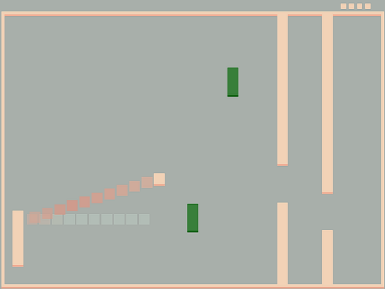

Gate Escape

Author: Ben Cagan (bcagan)

Design: Uses the pong paddle controls and ball physics to instead present a single-player action/puzzle game where the player 
must shoot the ball through a small gap in a gate.
Every 3 points represents a level, and after 10 levels, the game adds an additional gate, after 20, the stationary blocks begin
to move, and from then on the speed increases every 3 levels (which also occurs and resets ever 3 levels for the first 3 sets of 10 levels).

Screen Shot:

How To Play:

Use the left pong paddle (controlled using mouse cursor, move cursor up to move paddle up and down to move paddle down), to
hit the ball through the gap in the gate to hit the right wall. If you hit the wall, you get a point, if you hit the gate, you lose
a life. Every 3 points, you move on to the next level, and once your lives reach 0, the game resets. If you make it past level 10,
a second gate is added. There are also (initially) static blocks you can bounce the ball off of, and if you make it to level 20, 
the blocks start to move. The gap is randomly selected time you hit the wall/gate, and gets smaller with each level.

Sources:  http://www.cplusplus.com/reference/random/uniform_real_distribution/operator()/ used as a source to find how to use
a built in std library randomization function, but implemented entirely myself.

This game was built with [NEST](NEST.md).
